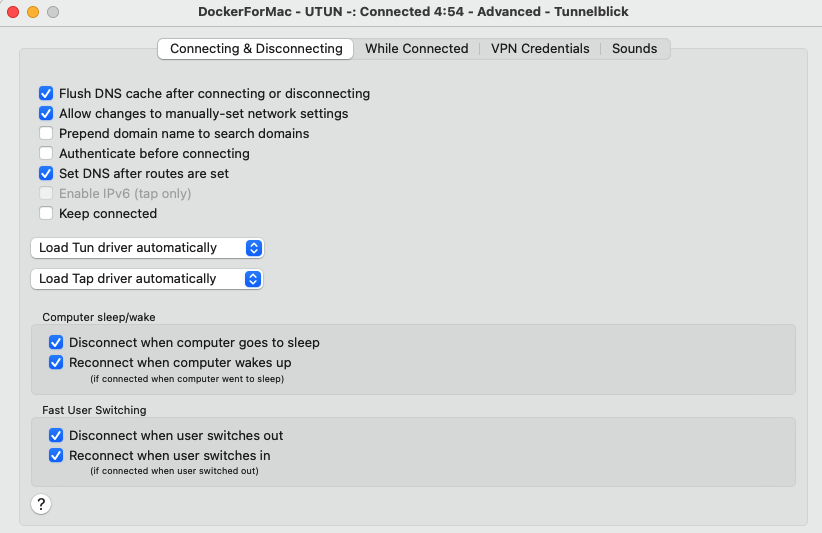

# macOS environment setup

**WARNING:** setting up environment and running tests in macOS is not officially supported.
Please notice that advises below are unofficial.

## Building sources of op-worker, oz-worker and onepanel (optional)

**Note:** This step is not needed if you want to start one-env using packages or launch
test on other existing environment.

If you wish to build your own sources to launch one-env environment using local build,
follow these tips for Docker for Mac:
- add: `/var/cache/ccache` and `/var/cache/rebar3` to _Resources > File sharing_ directories
- if you use Docker for Mac version 3.5.x or newer, set Docket context to `default`
using command:
```sh
docker context use default
```

## Python and it's packages

### Prerequisites for building Python

You should also install Command Line Tools for Xcode (version 12.5 is proven to work).
You can do this using `xcode-select --install` or download from https://developer.apple.com/download/all.

Also `brew` should be used to install dependencies needed to build Python.
Dependencies to install:

```bash
brew install zlib bzip2 openssl readline
```

### Python using Pyenv

Only Python in version 3.6.x (preferable 3.6.13) is currently supported.
It is recommended to install and use `virtualenv`
(http://sourabhbajaj.com/mac-setup/Python/virtualenv.html)

After installation of `virtualenv` you should install `3.6.13` (or newer) Python - there
are some issues with building it on macOS `11.1+`, so please use these pages for help:
- https://github.com/pyenv/pyenv/issues/1746
- https://github.com/pyenv/pyenv/issues/1746#issuecomment-780715744

For example this command should install desired Python version:

```bash
CFLAGS="-I$(brew --prefix openssl)/include -I$(brew --prefix bzip2)/include -I$(brew --prefix readline)/include -I$(xcrun --show-sdk-path)/usr/include" LDFLAGS="-L$(brew --prefix openssl)/lib -L$(brew --prefix readline)/lib -L$(brew --prefix zlib)/lib -L$(brew --prefix bzip2)/lib" pyenv install --patch 3.6.13 < <(curl -sSL https://github.com/python/cpython/commit/8ea6353.patch\?full_index\=1)
```

### Python packages

Install test scripts dependencies using: 

```
pip install -r tests/gui/requirements.txt
```

## Browser and browser test driver

Currently only Google Chrome is well-tested and supported to launch tests.
Please install recent version of Google Chrome and download suitable `chromedriver` from:
https://chromedriver.chromium.org/downloads. Make `chromedriver` executable and put it in
`/usr/local/bin/`. Then launch `/usr/local/bin/chromedriver` - macOS security should
block its execution, so go to preferences panel - privacy settings and unlock `chromedriver`.

## VPN for Kubernetes

Set up https://git.onedata.org/projects/VFS/repos/docker-openvpn-kube-for-mac/browse

On some networks there can be issue with setting nameserver. Please remove any custom DNS
server address specified in network settings. Then in advanced settings of Tunnelblick
VPN connection (Docker for Mac) enable option _"Allow changes to manually-set network settings"_.



After VPN setup, make sure that GUI is acessible via domain names, eg.
`curl -k https://dev-onezone.default.svc.cluster.local`. The domain name is shown when
one-env is settled using `./onenv status`.