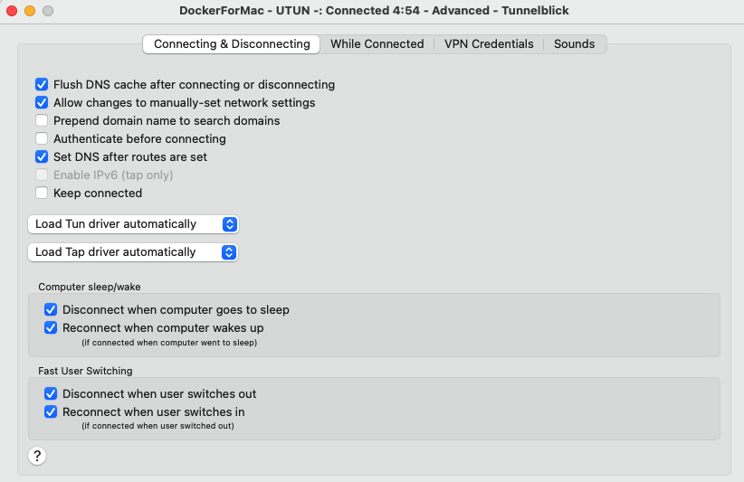

# Important notes

- It is recommended to use Chrome for tests because it's recent versions are frequently
used in tests development.
- Currently the highest supported version of Firefox is 46.0.x - v47 is not supported
due to incompatibility with build-in selenium Firefox driver.


# GUI acceptance/BDD tests

GUI acceptance/BDD test can be run in few ways using `./test_run.py`:
 1. Headless tests inside Pod on new Onedata environment (automatic setup)
 2. Tests using existing Onedata installation (or starting new, preserving Onedata installation after tests)
    1. Headless tests inside Pod
    2. Non-headless tests on local machine

For use in CI see `Makefile` in project's root.

**Common exectuion parameters:**

* `--test-type gui` - set the test type use by core Onedata test helpers to differ from
"cucumber" tests etc.
* `-t tests/gui` - standard `./test_run.py` parameter to set the test cases path to gui
tests. For example you can filter out tests to single suite using scenario file:
`-t tests/gui/scenarios/test_onezone_basic.py`.
* `--driver=<Firefox|Chrome>` - set the browser to test in (will be launched in headless mode)


# 1. Headless tests inside Pod on new Onedata environment

Using this method, the Onedata environment will be set up automatically with OZ and OP
(for details see `environments` dir with configurations). Setting up environment can take
some time.

**Example:** (invoke from onedata repo root dir)

```bash
./test_run.py -t tests/gui -i onedata/acceptance_gui:latest --test-type gui --driver=Chrome --xvfb --add-test-domain --update-etc-hosts
```

**Note:** while `--add-test-domain` and `--update-etc-hosts` are required when setting up
environment automatically, it can be problematic due to permissions of `/etc/hosts` file.
The experimental and **not safe** method is to do `sudo chmod go+w /etc/hosts` locally and
share `/etc` directory in docker.
Please contact our support if you have issues with updating `/etc/hosts` for testing.

**Note:** we recommend using `onedata/acceptance_gui:latest` testing docker image for
current version of tests. For legacy versions of tests, use image defined in `Makefile`.

**Parameters:** (see also common parameters description above)

* `-i onedata/gui_builder:latest` - use Docker image with dependencied for GUI tests
(i.a. Xvfb, Selenium, Firefox, Chrome)
* `--xvfb` - starts xvfb, necessary if used with headless tests
* `--update-etc-hosts` - adds entries to `/etc/hosts` for all pods in deployment.
When using this option script has to be run with root privileges.   
* `--add-test-domain` - when running tests on local machine option for adding entries to
`/etc/hosts` is turned off by default. This may cause that some test will fail.
You can enable adding entries to `/etc/hosts` using `--add-test-domain` option or add
entries manually.

**Optional parameters:** (for advanced usage)

* `--self-contained-html` - optional, if used generated report will be contained in 1 html file
* `--firefox-logs` - optional, if used and driver is Firefox generated report will contain
console logs from browser
* `--no-mosaic-filter` - optional, if set videos of tests using multiple browsers will
be recorded as different video for each browser (mosaic video created by default) 
* `--sources` - optional, if set starts Onedata environment using sources. Sources have
to be located in appropriate directories.


# 2. Tests using existing Onedata installation

Using this method, existing Onedata installation will be used if available

To start Onedata installation navigate to one_env directory and run

```bash
./onenv up -f ../tests/gui/environments/<env_file>
```

Where `env_file` is one of the yamls describing the environment.

For example 2-provider environment:

```bash
./onenv up -f ../tests/gui/environments/1oz_2op_deployed.yaml
```

## 2.1. Headless tests inside Pod

Example: (invoke from onedata repo root dir)
```
./test_run.py -t tests/gui --test-type gui --driver=Chrome -i onedata/acceptance_gui:latest --no-clean --xvfb --xvfb-recording=failed
```

**New parameters:**

* `--xvfb-recording=<all|none|failed>` - optional, record all or none or failed tests
as movies and save them to `<logdir>/movies`
* `--no-clean` - prevents deleting environment after tests

## 2.2. Non-headless using local machine (BDD)

**Note:** setting up environment in macOS can be tricky, see **macOS environment setup**
section in this document for detailed instructions.

### Environment setup

Currently, only **Python 3.6.x** is supported and well tested.

These tests will be run using `py.test` runner on local machine.
Required Python packages to install (e.g. using `pip install`) are listed
in requirement file: `tests/gui/requirements.txt`

A handy oneliner to install Python dependencies (invoke from repo root):

```bash
pip install -r tests/gui/requirements.txt
```

Additional applications required in system:

* `xclip` (Linux) or `pbcopy` (macOS)

A browser selected for tests (with `--driver`) should be also installed with test driver
executable. For example you can install Google Chrome and a `chromedriver` in suitable
version for it from: https://chromedriver.chromium.org/downloads.

### Starting tests

**Note:** the one-env environment that is set up should be accessible via hostnames
(eg. https://dev-onezone.default.svc.cluster.local). Make sure that you can open address
of Onezone in your browser before starting tests.

Example working both on **Linux** and **macOS**: (invoke from onedata repo root dir)

```bash
./test_run.py -t tests/gui --test-type gui --driver=Chrome --local --no-clean
```

**New parameters:**

* `--local` - starts tests on host instead of starting them in pod.

# 3. macOS environment setup

## Building sources of op-worker, oz-worker and onepanel (optional)

**Note:** This step is not needed if you want to start one-env using packages or launch
test on other existing environment.

If you wish to build your own sources to launch one-env environment using local build,
follow these tips for Docker for Mac:
- add: `/var/cache/ccache` and `/var/cache/rebar3` to _Resources > File sharing_ directories
- if you use Docker for Mac version 3.5.x or newer, set Docket context to `default`
using command:
```sh
docker context use default
```

## Python and it's packages

### Prerequisites for building Python

You should also install Command Line Tools for Xcode (version 12.5 is proven to work).
You can do this using `xcode-select --install` or download from https://developer.apple.com/download/all.

Also `brew` should be used to install dependencies needed to build Python.
Depedencies to install:

```bash
brew install zlib bzip2 openssl readline
```

### Python using Pyenv

Only Python in version 3.6.x (preferable 3.6.13) is currently supported.
It is recommended to install and use `virtualenv`
(http://sourabhbajaj.com/mac-setup/Python/virtualenv.html)

After installation of `virtualenv` you should install `3.6.13` (or newer) Python - there
are some issues with building it on macOS `11.1+`, so please use these pages for help:
- https://github.com/pyenv/pyenv/issues/1746
- https://github.com/pyenv/pyenv/issues/1746#issuecomment-780715744

For example this command should install desired Python version:

```bash
CFLAGS="-I$(brew --prefix openssl)/include -I$(brew --prefix bzip2)/include -I$(brew --prefix readline)/include -I$(xcrun --show-sdk-path)/usr/include" LDFLAGS="-L$(brew --prefix openssl)/lib -L$(brew --prefix readline)/lib -L$(brew --prefix zlib)/lib -L$(brew --prefix bzip2)/lib" pyenv install --patch 3.6.13 < <(curl -sSL https://github.com/python/cpython/commit/8ea6353.patch\?full_index\=1)
```

### Python packages

Install test scripts dependencies using: 

```
pip install -r tests/gui/requirements.txt
```

## Browser and browser test driver

Currently only Google Chrome is well-tested and supported to launch tests.
Please install recent version of Google Chrome and download suitable `chromedriver` from:
https://chromedriver.chromium.org/downloads. Make `chromedriver` executable and put it in
`/usr/local/bin/`. Then launch `/usr/local/bin/chromedriver` - macOS security should
block its execution, so go to preferences panel - privacy settings and unlock `chromedriver`.

## VPN for Kubernetes

Set up https://git.onedata.org/projects/VFS/repos/docker-openvpn-kube-for-mac/browse

On some networks there can be issue with setting nameserver. Please remove any custom DNS
server address specified in network settings. Then in advanced settings of Tunnelblick
VPN connection (Docker for Mac) enable option _"Allow changes to manually-set network settings"_.



After VPN setup, make sure that GUI is acessible via domain names, eg.
`curl -k https://dev-onezone.default.svc.cluster.local`. The domain name is shown when
one-env is settled using `./onenv status`.

# Test reports

The test report in HTML format with embedded screenshots of browser in failed test will be saved to:
`<onedata_repo_root>/tests/gui/logs/report.<time_stamp>/report.html`

# Taking screenshots

For some purposes, taking screenshots can be required in time of test run.

In steps of scenarios simply use:
```python
driver.get_screenshot_as_file('/tmp/some-screenshot.png')
```
where driver is instance of Selenium WebDriver

# Development

Please read these section before you start writing or modifying GUI tests.

## Fixtures and pytest plugins overrides

* The default configuration of `pytest-selenium-multi` for sensitive URLs is inverted:
all tests are considered *non-destructive by default*.
You can add a `@pytest.mark.destructive` mark to test scenario to mark test as destructive.

* The `sensitive_url` fixture has module scope, because we start new environment for each module
(so it could have different `base_url's`)
